# System Architecture Documentation

## Complete Event Flow

```mermaid
sequenceDiagram
    actor User
    participant Frontend
    participant Basket
    participant EventBridge
    participant OrderQ as Order Queue
    participant InvQ as Inventory Queue  
    participant PayQ as Payment Queue
    participant Ordering
    participant Inventory
    participant Payment
    participant DynamoDB

    User->>Frontend: Checkout Cart (3 items, $150)
    Frontend->>Basket: POST /basket/checkout
    Basket->>DynamoDB: Save Basket
    Basket->>EventBridge: Publish CheckoutBasket Event
    Basket->>DynamoDB: Delete Basket
    Basket-->>Frontend: 200 OK
    
    Note over Frontend: Redirects to My Orders<br/>Auto-refresh starts
    
    par Fan-out to 3 Services
        EventBridge->>OrderQ: Route to Order Queue
        EventBridge->>InvQ: Route to Inventory Queue
        EventBridge->>PayQ: Route to Payment Queue
    end
    
    par Parallel Async Processing
        OrderQ->>Ordering: Trigger Lambda
        Ordering->>DynamoDB: CREATE Order Record
        Note over Ordering: Order saved
        and
        InvQ->>Inventory: Trigger Lambda
        Inventory->>DynamoDB: UPDATE Stock (-3)
        Note over Inventory: Stock: 100→97
        and
        PayQ->>Payment: Trigger Lambda
        Payment->>Payment: Process Payment<br/>(90% success)
        Payment->>DynamoDB: CREATE Payment Record
        Payment->>EventBridge: Publish PaymentCompleted
        Note over Payment: Payment: COMPLETED
    end
    
    Note over Frontend: Auto-refresh (5s)<br/>Shows new order
    Frontend->>Frontend: Refresh (attempt 1)
    Note over Frontend: Auto-refresh (10s)
    Frontend->>Frontend: Refresh (attempt 2)
    Note over Frontend: Auto-refresh (15s)<br/>Stops auto-refresh
    Frontend->>Frontend: Final refresh
```


## Database Schema

### Product Table
```
PK: id (String)
Attributes:
- name: String
- description: String
- price: Number
- category: String
- availableStock: Number
- reorderLevel: Number
- lastRestocked: String (ISO timestamp)
```

### Basket Table
```
PK: userName (String)
Attributes:
- items: List
  - productId: String
  - productName: String
  - price: Number
  - quantity: Number
```

### Order Table
```
PK: userName (String)
SK: orderDate (String - ISO timestamp)
Attributes:
- totalPrice: Number
- items: List
```

### Payment Table
```
PK: paymentId (String)
Attributes:
- userName: String
- orderDate: String
- amount: Number
- status: String (COMPLETED/FAILED)
- paymentMethod: String
- processedAt: String
- transactionId: String
- failureReason: String (if failed)
```

## Event Types

### 1. CheckoutBasket Event
```json
{
  "source": "com.swn.basket.checkoutbasket",
  "detailType": "CheckoutBasket",
  "detail": {
    "userName": "john",
    "totalPrice": 150.00,
    "items": [...]
  }
}
```

### 2. PaymentCompleted Event
```json
{
  "source": "com.swn.payment",
  "detailType": "PaymentCompleted",
  "detail": {
    "userName": "john",
    "orderDate": "2025-12-01T...",
    "paymentId": "PAY-123...",
    "amount": 150.00
  }
}
```

### 3. PaymentFailed Event
```json
{
  "source": "com.swn.payment",
  "detailType": "PaymentFailed",
  "detail": {
    "userName": "john",
    "paymentId": "PAY-123...",
    "amount": 150.00
  }
}
```

## Scalability Considerations

- **Lambda Auto-scaling**: Handles 1000+ concurrent requests
- **DynamoDB On-Demand**: Scales with traffic
- **SQS Buffering**: Handles traffic spikes
- **EventBridge Fan-out**: Decouples services
- **Stateless Services**: Easy horizontal scaling

