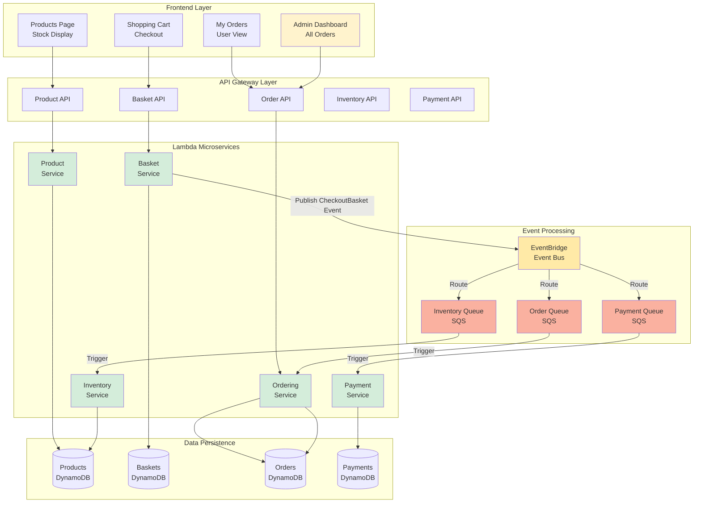
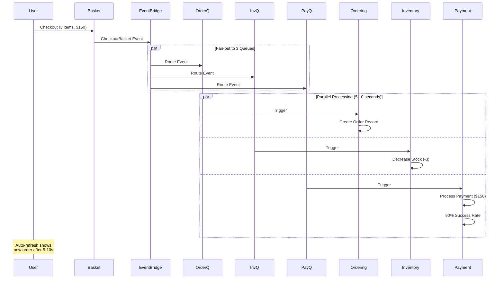

# CS6620 Final Project: Building a Scalable E-commerce Platform with AWS Serverless Microservices

A full-stack e-commerce application built with AWS serverless architecture, featuring **5 event-driven microservices**, real-time inventory management, payment processing, and a complete shopping experience.

**🎓 Course**: CS6620 - Cloud Computing  
**🏫 University**: Northeastern University  
**👥 Team Members**: Shih-Jui Heh, Xinya Zhou, Tzu-Ying Liu
**📅 Date**: Fall 2025

---

## 🏗️ System Overview

This project implements a **5-microservice architecture** with event-driven communication and asynchronous processing.

### Microservices

1. **Product Service** - Product catalog management with inventory tracking
2. **Basket Service** - Shopping cart operations and checkout
3. **Ordering Service** - Order creation and history management
4. **Inventory Service** - Automatic stock level updates on orders
5. **Payment Service** - Payment processing with 90% success simulation

### Architecture Highlights

- ✅ **Event-Driven Design** - EventBridge + 3 SQS queues for async communication
- ✅ **Fan-Out Pattern** - Single checkout event triggers 3 parallel processes
- ✅ **Real-Time Inventory** - Stock decreases automatically on order placement
- ✅ **Payment Simulation** - 90% success rate with transaction tracking
- ✅ **CORS-Enabled APIs** - Full frontend-backend integration
- ✅ **Infrastructure as Code** - Complete AWS CDK implementation

---

## 📊 Complete System Architecture


---

## 🔄 Event-Driven Flow

### Checkout Event Chain


---

## 💳 Payment Service Details

- **Success Rate**: 90% (simulated)
- **Payment Methods**: Credit Card
- **Transaction IDs**: Auto-generated for successful payments
- **Failure Handling**: Records failure reason
- **Event Publishing**: Publishes `PaymentCompleted` or `PaymentFailed` events
- **API Endpoints**:
  - `GET /payment` - All payments (admin)
  - `GET /payment/{userName}` - User's payment history

---

## 🛠️ Technologies

### Backend (AWS)
- **AWS Lambda** - 5 serverless functions (Node.js 18)
- **API Gateway** - 5 REST APIs with CORS
- **DynamoDB** - 4 NoSQL tables
- **EventBridge** - Event bus for pub/sub
- **SQS** - 3 message queues (Order, Inventory, Payment)
- **CloudWatch** - Logging and monitoring
- **AWS CDK** - Infrastructure as Code (TypeScript)

### Frontend
- **HTML5/CSS3** - Responsive design
- **Vanilla JavaScript** - No frameworks
- **LocalStorage** - Client-side cart
- **Fetch API** - REST API calls

---

## 🚀 Quick Start

### Prerequisites
```bash
- AWS Account
- AWS CLI configured
- Node.js 18+
- Docker Desktop
- AWS CDK CLI
```

### Deploy Backend
```bash
# Clone repository
git clone https://github.com/yarinacs/CS6200final_project.git
cd CS6200final_project

# Install dependencies
npm install

# Install dependencies for each microservice
cd src/product && npm install && cd ../..
cd src/basket && npm install && cd ../..
cd src/ordering && npm install && cd ../..
cd src/inventory && npm install && cd ../..
cd src/payment && npm install && cd ../..

# Bootstrap CDK (first time only)
cdk bootstrap

# Deploy (requires Docker running!)
cdk deploy
```

### Run Frontend
```bash
cd frontend
open products.html
```

---

## 📁 Project Structure
```
├── lib/                          # AWS CDK Infrastructure
│   ├── aws-microservices-stack.ts   # Main stack
│   ├── microservice.ts             # 5 Lambda functions
│   ├── apigateway.ts               # 5 API Gateways
│   ├── database.ts                 # 4 DynamoDB tables
│   ├── eventbus.ts                 # EventBridge config
│   └── queue.ts                    # 3 SQS queues
├── src/                          # Microservices Source Code
│   ├── product/                  # Product management + inventory
│   ├── basket/                   # Shopping cart + checkout
│   ├── ordering/                 # Order processing
│   ├── inventory/                # Stock management
│   └── payment/                  # Payment processing
├── frontend/                     # Web Application
│   ├── products.html            # Product catalog (user)
│   ├── basket.html              # Shopping cart (user)
│   ├── my-orders.html           # Personal orders (user)
│   ├── order-dashboard.html     # All orders (admin)
│   ├── api-config.js            # API endpoints
│   ├── api.js                   # API functions
│   ├── cart.js                  # Cart management
│   └── render.js                # UI rendering
└── bin/
    └── aws-microservices.ts     # CDK entry point
```

---

## 🎯 Key Features

### User Features
- 📦 Browse 10+ products with real-time stock levels
- 🛒 Add to cart with stock validation
- 💳 Secure checkout process
- 📋 View personal order history
- 🔄 Auto-refresh for new orders (every 5s, 3 times)

### Admin Features
- 👨‍💼 View all orders across users
- 📊 Revenue and customer analytics
- 🔍 Search and filter capabilities
- 📅 Time-based filtering

### Backend Features
- ⚡ Asynchronous order processing
- 📉 Automatic inventory updates
- 💰 Payment simulation (90% success)
- 🔔 Event-driven notifications
- 🛡️ Conditional stock updates (prevents negative inventory)

---

## 📡 API Endpoints

| Service | Base URL | Endpoints |
|---------|----------|-----------|
| **Product** | `/product` | GET (all), POST (create) |
| | `/product/{id}` | GET, PUT, DELETE |
| **Basket** | `/basket` | GET (all), POST (create) |
| | `/basket/{userName}` | GET, DELETE |
| | `/basket/checkout` | POST |
| **Order** | `/order` | GET (all) |
| | `/order/{userName}` | GET |
| **Inventory** | `/inventory` | GET |
| **Payment** | `/payment` | GET (all) |
| | `/payment/{userName}` | GET |

---

## 🧪 Testing the Complete Flow
```bash
# 1. Create product with inventory
curl -X POST https://YOUR-PRODUCT-API/prod/product \
  -H "Content-Type: application/json" \
  -d '{
    "name": "Test Product",
    "price": 99.99,
    "availableStock": 100,
    "reorderLevel": 10
  }'

# 2. Add to basket
curl -X POST https://YOUR-BASKET-API/prod/basket \
  -H "Content-Type: application/json" \
  -d '{
    "userName": "testuser",
    "items": [{
      "productId": "YOUR-PRODUCT-ID",
      "productName": "Test Product",
      "price": 99.99,
      "quantity": 5
    }]
  }'

# 3. Checkout (triggers 3 async processes!)
curl -X POST https://YOUR-BASKET-API/prod/basket/checkout \
  -H "Content-Type: application/json" \
  -d '{"userName": "testuser"}'

# 4. Wait for async processing
sleep 10

# 5. Verify order created
curl https://YOUR-ORDER-API/prod/order

# 6. Verify inventory decreased (100 → 95)
curl https://YOUR-PRODUCT-API/prod/product

# 7. Verify payment processed
curl https://YOUR-PAYMENT-API/prod/payment
```

**Expected Results:**
- ✅ Order created with userName: "testuser"
- ✅ Stock decreased from 100 to 95
- ✅ Payment record with status: "COMPLETED" (90% chance) or "FAILED" (10% chance)

---

## 🎓 Learning Outcomes

### AWS Services Mastered
- Lambda functions with event sources
- DynamoDB table design and operations
- API Gateway with CORS configuration
- EventBridge event routing
- SQS queue management
- CDK Infrastructure as Code

### Architecture Patterns
- Event-driven microservices
- Fan-out messaging pattern
- Async processing with queues
- CQRS (Command Query Responsibility Segregation)
- Eventual consistency

### Best Practices
- Separation of concerns
- Idempotent operations
- Error handling and retries
- Conditional database updates
- Structured logging

---

## 📈 System Metrics

- **Microservices**: 5
- **API Endpoints**: 11
- **DynamoDB Tables**: 4
- **SQS Queues**: 3
- **Event Types**: 3 (CheckoutBasket, PaymentCompleted, PaymentFailed)
- **Frontend Pages**: 4
- **Average Response Time**: < 100ms (sync) / 5-10s (async)

---

## 🔮 Future Enhancements

- [ ] User Authentication (AWS Cognito)
- [ ] Real payment gateway integration (Stripe)
- [ ] Shipping/Tracking Service
- [ ] Email Notification Service
- [ ] Product Reviews Service
- [ ] Image upload to S3
- [ ] Search with OpenSearch
- [ ] CI/CD with GitHub Actions
- [ ] Monitoring dashboards with CloudWatch

---

## 🗑️ Cleanup

Remove all AWS resources:
```bash
cdk destroy
```

⚠️ This will delete:
- 5 Lambda functions
- 5 API Gateways
- 4 DynamoDB tables
- 3 SQS queues
- 1 EventBridge bus
- All associated IAM roles

---

## 📞 Team

- **GitHub**: [@yarinacs](https://github.com/yarinacs)
- **Repository**: [CS6200final_project](https://github.com/yarinacs/CS6200final_project)

---

## 📄 License

Educational project for CS6620 - Northeastern University

---

**Built with ❤️ using AWS Serverless Technologies**

### Tech Stack Summary
```
Frontend:  HTML + CSS + JavaScript
Backend:   AWS Lambda (Node.js 18)
Database:  DynamoDB (4 tables)
Events:    EventBridge + SQS (3 queues)
IaC:       AWS CDK (TypeScript)
Region:    us-west-2
```
