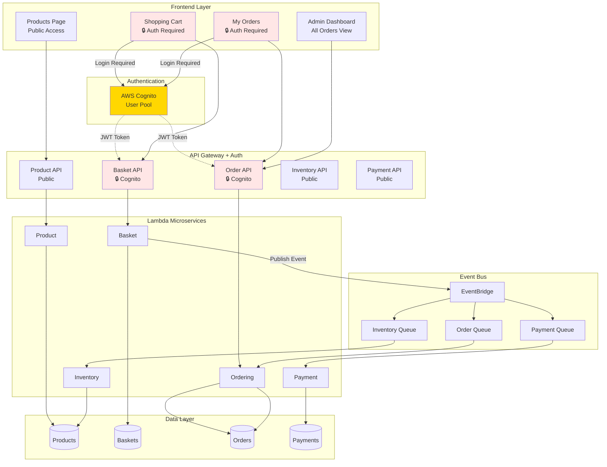
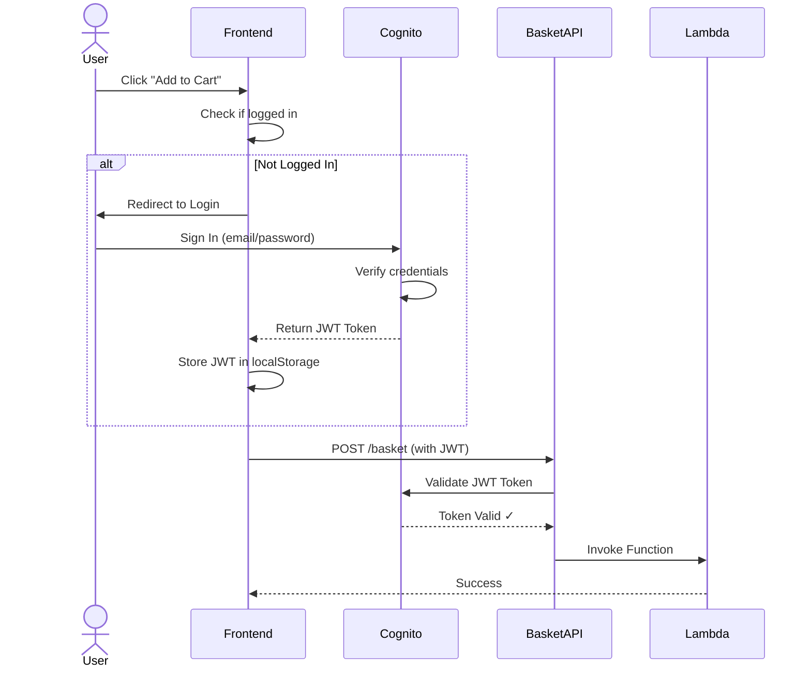

# CS6620 Final Project: AWS Serverless Microservices E-Commerce System

A production-grade e-commerce application with **5 microservices**, **AWS Cognito authentication**, **event-driven architecture**, and **real-time inventory management**.

**🎓 Course**: CS6620 - Cloud Computing  
**🏫 University**: Northeastern University  
**👥 Team**: Rina + Teammates  
**📅 Semester**: Fall 2025

---

## 🏗️ System Architecture

### 5 Microservices
1. **Product Service** - Product catalog with inventory tracking
2. **Basket Service** - Shopping cart (🔒 requires authentication)
3. **Ordering Service** - Order processing  
4. **Inventory Service** - Automatic stock updates
5. **Payment Service** - Payment processing (90% success simulation)

### Security & Authentication
- ✅ **AWS Cognito User Pool** - Email-based authentication
- ✅ **Protected APIs** - Basket and Order require login
- ✅ **JWT Tokens** - Secure API access
- ✅ **Self-registration** - Users can sign up

### Event-Driven Architecture
```
Checkout → EventBridge → [3 SQS Queues]
                           ├─→ Order Lambda
                           ├─→ Inventory Lambda  
                           └─→ Payment Lambda
```

---

## 📊 Complete Architecture Diagram


---

## 🔐 Authentication Flow


---

## 🚀 Deployment

### Prerequisites
```bash
✅ AWS Account
✅ AWS CLI configured
✅ Node.js 18+
✅ Docker Desktop (running)
✅ AWS CDK CLI (npm install -g aws-cdk)
```

### Deploy Complete System
```bash
# Clone
git clone https://github.com/yarinacs/CS6200final_project.git
cd CS6200final_project

# Install
npm install

# Install microservice dependencies
for dir in src/*/; do
    cd "$dir" && npm install && cd ../..
done

# Deploy (creates all 5 services + Cognito)
cdk deploy
```

**Deployment creates:**
- 5 Lambda functions
- 5 API Gateways (2 with Cognito auth)
- 4 DynamoDB tables
- 3 SQS queues
- 1 EventBridge bus
- 1 Cognito User Pool
- All IAM roles and permissions

---

## 🔑 Post-Deployment Configuration

After `cdk deploy` completes, update frontend with Cognito credentials:

1. **Copy the outputs**:
```
UserPoolId: us-west-2_z2fBXCYPE
ClientId: 3l010221o7njf89t9f2tdhc96b
```

2. **Update `frontend/auth.js`**:
```javascript
const poolData = {
    UserPoolId: 'us-west-2_z2fBXCYPE',  // Your actual pool ID
    ClientId: '3l010221o7njf89t9f2tdhc96b'  // Your actual client ID
};
```

---

## 🎯 Features

### Public Features (No Login Required)
- 📦 Browse product catalog with live stock levels
- 👀 View product details and descriptions
- 💰 See real-time pricing
- 📊 View admin dashboard (all orders)

### Authenticated Features (Login Required)
- 🛒 Add items to shopping cart
- ✅ Checkout and place orders
- 📋 View personal order history
- 🗑️ Manage basket items

### Automatic Backend Processes
- 📉 Stock levels decrease automatically on order
- 💳 Payment processing (90% success rate)
- 📧 Email verification for new users
- 🔔 Event-driven order fulfillment

---

## 🧪 Testing

### Test Public APIs (No Auth)
```bash
# Get all products
curl https://r1s0vteiq3.execute-api.us-west-2.amazonaws.com/prod/product

# Get all payments (admin view)
curl https://bfjw73l1m9.execute-api.us-west-2.amazonaws.com/prod/payment
```

### Test Protected APIs (With Cognito)

Basket and Order APIs require JWT token. Use the frontend to:
1. Register account at `index.html`
2. Verify email
3. Login
4. Use shopping cart

---

## 📡 API Endpoints

| Service | Endpoint | Auth | Methods |
|---------|----------|------|---------|
| Product | `/product` | ❌ Public | GET, POST |
| | `/product/{id}` | ❌ Public | GET, PUT, DELETE |
| **Basket** | `/basket` | 🔒 **Cognito** | GET, POST |
| | `/basket/{userName}` | 🔒 **Cognito** | GET, DELETE |
| | `/basket/checkout` | 🔒 **Cognito** | POST |
| **Order** | `/order` | 🔒 **Cognito** | GET |
| | `/order/{userName}` | 🔒 **Cognito** | GET |
| Inventory | `/inventory` | ❌ Public | GET |
| Payment | `/payment` | ❌ Public | GET |
| | `/payment/{userName}` | ❌ Public | GET |

---

## 💳 Payment Service Details

- **Processing**: Automatic on checkout event
- **Success Rate**: 90% (simulated)
- **Transaction IDs**: Auto-generated for successful payments
- **Failure Handling**: Records reason in DynamoDB
- **Events Published**: `PaymentCompleted` / `PaymentFailed`

### Example Payment Record
```json
{
  "paymentId": "PAY-1733187234567-ABC123",
  "userName": "user@example.com",
  "amount": 2499.99,
  "status": "COMPLETED",
  "transactionId": "TXN-1733187234789",
  "paymentMethod": "Credit Card",
  "processedAt": "2025-12-02T10:30:00Z"
}
```

---

## 📈 Current System State

### Products in Catalog: 10
- MacBook Pro ($2,499.99) - Stock: 42
- iPad Pro ($1,099.99) - Stock: 22
- iPhone 15 Pro ($999.99) - Stock: 80
- Laptop ($1,299.99) - Stock: 35
- Apple Watch Series 9 ($399.99) - Stock: 55
- AirPods Pro 2 ($249.99) - Stock: 120
- Sony WH-1000XM5 ($399.99) - Stock: 40
- Magic Keyboard ($149.99) - Stock: 65
- Logitech MX Master 3S ($99.99) - Stock: 85
- Samsung 34" Ultrawide ($549.99) - Stock: 20

### Payment Records: 21 transactions processed
### Event Flow: Fully operational with 3-way fan-out

---

## 🎓 Key Learning Outcomes

### AWS Services Implemented
- ✅ Lambda (5 functions, Node.js 18)
- ✅ API Gateway (5 REST APIs, 2 with Cognito)
- ✅ DynamoDB (4 tables)
- ✅ Cognito (User Pool + Client)
- ✅ EventBridge (Event bus with routing)
- ✅ SQS (3 queues for async processing)
- ✅ CloudWatch (Logging and monitoring)
- ✅ IAM (Least-privilege roles)

### Architecture Patterns
- Event-driven microservices
- Fan-out messaging (1→3)
- Asynchronous processing
- JWT-based authentication
- CORS-enabled APIs
- Conditional updates (prevent negative stock)

---

## 🔮 Future Enhancements

- [ ] Shipping/Tracking Service
- [ ] Email Notification Service  
- [ ] Product Reviews & Ratings
- [ ] Real-time inventory alerts (SNS)
- [ ] Image uploads (S3 + CloudFront)
- [ ] Advanced search (OpenSearch)
- [ ] CI/CD pipeline (GitHub Actions)
- [ ] Production monitoring (X-Ray)

---

## 🗑️ Cleanup
```bash
cdk destroy
```

Removes:
- 5 Lambda functions
- 5 API Gateways
- 4 DynamoDB tables
- 3 SQS queues
- 1 EventBridge bus
- 1 Cognito User Pool
- All IAM roles

---

## 📞 Team

- **Repository**: [CS6200final_project](https://github.com/yarinacs/CS6200final_project)
- **GitHub**: [@yarinacs](https://github.com/yarinacs)

---

## 📄 Project Status

✅ **Backend**: 5 microservices fully deployed  
✅ **Authentication**: Cognito user management active  
✅ **Event Flow**: 3-way fan-out operational  
✅ **Payment**: 21 transactions processed  
✅ **Inventory**: Real-time stock management  
✅ **Frontend**: Product browsing + Admin dashboard  
⚠️ **Shopping Cart**: Requires Cognito login (by design)

---

**Built with ❤️ using AWS Serverless + Cognito Authentication**

🔐 Secure • ⚡ Scalable • 🎯 Event-Driven
