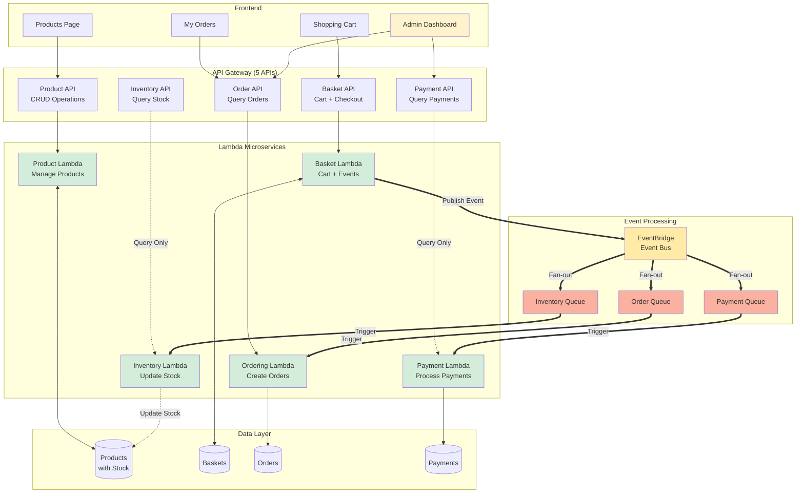

# CS6620 Final Project: Building a Scalable E-commerce Platform with AWS Serverless Microservices

A full-stack e-commerce application built with **5 event-driven microservices**, real-time inventory management, automated payment processing, and complete shopping workflow.

**🎓 Course**: CS6620 - Cloud Computing  
**🏫 University**: Northeastern University  
**👥 Team**: Shih-Jui Heh, Xinya Zhou, Tzu-Ying Liu 
**📅 Semester**: Fall 2025

---

## 🏗️ System Overview

### 5 Microservices Architecture

1. **Product Service** - Product catalog with inventory tracking
2. **Basket Service** - Shopping cart and checkout operations
3. **Ordering Service** - Order creation and history management
4. **Inventory Service** - Automatic stock level updates
5. **Payment Service** - Payment processing with transaction tracking

### Architecture Highlights

- ✅ **Event-Driven Design** - EventBridge + 3 SQS queues
- ✅ **Fan-Out Pattern** - Single checkout triggers 3 parallel processes
- ✅ **Real-Time Inventory** - Stock automatically decreases on orders
- ✅ **Payment Simulation** - 90% success rate with transaction IDs
- ✅ **Async Processing** - Non-blocking order fulfillment (5-10s)
- ✅ **CORS-Enabled APIs** - Full frontend integration
- ✅ **Infrastructure as Code** - AWS CDK implementation

---

## 📊 Complete System Architecture


**Legend:**
- Solid lines (→) = Synchronous REST API calls
- Dashed lines (-.→) = Query-only API access
- Double lines (=⇒) = Asynchronous event-driven triggers

**Key Architecture Points:**

1. **All 5 APIs connect to their Lambda functions** for synchronous operations
2. **Inventory & Payment have dual entry points**:
   - API Gateway (for queries): GET stock levels / payment records
   - SQS Queue (for processing): UPDATE stock / CREATE payments
3. **Event fan-out**: 1 checkout → 3 parallel processes

---

## 🔄 Complete Checkout Flow


---

## 💳 Payment Service Features

- **Automatic Processing**: Triggered by checkout events
- **Success Rate**: 90% (10% simulated failures)
- **Transaction IDs**: Auto-generated for successful payments
- **Failure Tracking**: Records failure reasons
- **Payment Methods**: Credit Card (simulated)
- **Event Publishing**: Emits PaymentCompleted/PaymentFailed events

### Payment Record Example
```json
{
  "paymentId": "PAY-1733187234567-ABC123",
  "userName": "john",
  "amount": 2499.99,
  "status": "COMPLETED",
  "transactionId": "TXN-1733187234789",
  "paymentMethod": "Credit Card",
  "processedAt": "2025-12-02T10:30:00Z"
}
```

---

## 🚀 Quick Start

### Prerequisites
```
✅ AWS Account configured
✅ Node.js 18+
✅ Docker Desktop running
✅ AWS CDK installed: npm install -g aws-cdk
```

### Deploy Backend
```bash
# Clone repository
git clone https://github.com/yarinacs/CS6200final_project.git
cd CS6200final_project

# Install dependencies
npm install

# Install each microservice dependencies
cd src/product && npm install && cd ../..
cd src/basket && npm install && cd ../..
cd src/ordering && npm install && cd ../..
cd src/inventory && npm install && cd ../..
cd src/payment && npm install && cd ../..

# Bootstrap CDK (first time only)
cdk bootstrap

# Deploy all services
cdk deploy
```

**Deployment creates:**
- 5 Lambda functions (Node.js 18)
- 5 REST APIs with CORS
- 4 DynamoDB tables
- 3 SQS queues
- 1 EventBridge event bus
- All IAM roles and policies

### Run Frontend
```bash
cd frontend
open products.html
```

---

## 📁 Project Structure
```
├── lib/                      # AWS CDK Infrastructure
│   ├── aws-microservices-stack.ts  # Main stack orchestration
│   ├── microservice.ts             # 5 Lambda function definitions
│   ├── apigateway.ts               # 5 API Gateway configurations
│   ├── database.ts                 # 4 DynamoDB tables
│   ├── eventbus.ts                 # EventBridge rules
│   ├── queue.ts                    # 3 SQS queues
│   └── auth.ts                     # Cognito (optional)
├── src/                      # Microservices Source Code
│   ├── product/             # Product management + inventory fields
│   ├── basket/              # Shopping cart + checkout
│   ├── ordering/            # Order processing
│   ├── inventory/           # Automatic stock updates
│   └── payment/             # Payment processing + events
├── frontend/                 # Web Application
│   ├── products.html        # Product catalog (10 products)
│   ├── basket.html          # Shopping cart & checkout
│   ├── my-orders.html       # Personal order history
│   ├── order-dashboard.html # Admin analytics dashboard
│   ├── api-config.js        # API endpoint configuration
│   ├── api.js               # API wrapper functions
│   ├── cart.js              # Cart management (localStorage)
│   └── render.js            # UI rendering logic
└── bin/
    └── aws-microservices.ts # CDK app entry point
```

---

## 🛠️ Technologies

### AWS Services
- **Lambda** - 5 serverless functions (Node.js 18)
- **API Gateway** - 5 REST APIs with CORS
- **DynamoDB** - 4 NoSQL tables (on-demand billing)
- **EventBridge** - Event bus with routing rules
- **SQS** - 3 message queues (Order, Inventory, Payment)
- **CloudWatch** - Logs and monitoring
- **AWS CDK** - Infrastructure as Code (TypeScript)
- **Cognito** - User pool (optional, not currently enforced)

### Frontend
- **Vanilla JavaScript** - No frameworks required
- **HTML5/CSS3** - Responsive design
- **LocalStorage** - Client-side cart persistence
- **Fetch API** - Async HTTP requests

---

## 📡 API Endpoints

| Service | Base Path | Methods | Authentication |
|---------|-----------|---------|----------------|
| **Product** | `/product` | GET, POST | ❌ None |
| | `/product/{id}` | GET, PUT, DELETE | ❌ None |
| **Basket** | `/basket` | GET, POST | ❌ None |
| | `/basket/{userName}` | GET, DELETE | ❌ None |
| | `/basket/checkout` | POST | ❌ None |
| **Order** | `/order` | GET | ❌ None |
| | `/order/{userName}` | GET | ❌ None |
| **Inventory** | `/inventory` | GET | ❌ None |
| **Payment** | `/payment` | GET | ❌ None |
| | `/payment/{userName}` | GET | ❌ None |

**Base URLs** (after deployment):
- Product: `https://r1s0vteiq3.execute-api.us-west-2.amazonaws.com/prod/`
- Basket: `https://w59p21h029.execute-api.us-west-2.amazonaws.com/prod/`
- Order: `https://3g0qh62cub.execute-api.us-west-2.amazonaws.com/prod/`
- Inventory: `https://myk4rv1y38.execute-api.us-west-2.amazonaws.com/prod/`
- Payment: `https://bfjw73l1m9.execute-api.us-west-2.amazonaws.com/prod/`

---

## 🧪 Testing the Complete Flow

### End-to-End Test
```bash
# 1. View products with inventory
curl https://r1s0vteiq3.execute-api.us-west-2.amazonaws.com/prod/product

# 2. Add to basket
curl -X POST https://w59p21h029.execute-api.us-west-2.amazonaws.com/prod/basket \
  -H "Content-Type: application/json" \
  -d '{
    "userName": "testuser",
    "items": [{
      "productId": "5a1bb657-5158-48f8-8703-c91adab41e99",
      "productName": "MacBook Pro",
      "price": 2499.99,
      "quantity": 2
    }]
  }'

# 3. Checkout (triggers async flow!)
curl -X POST https://w59p21h029.execute-api.us-west-2.amazonaws.com/prod/basket/checkout \
  -H "Content-Type: application/json" \
  -d '{"userName": "testuser"}'

# 4. Wait for async processing
echo "⏳ Waiting 10 seconds for async processing..."
sleep 10

# 5. Verify order created
echo "📦 Checking orders..."
curl https://3g0qh62cub.execute-api.us-west-2.amazonaws.com/prod/order | python3 -m json.tool

# 6. Verify inventory decreased (42 → 40)
echo "📉 Checking inventory..."
curl https://r1s0vteiq3.execute-api.us-west-2.amazonaws.com/prod/product | python3 -m json.tool

# 7. Verify payment processed
echo "💳 Checking payments..."
curl https://bfjw73l1m9.execute-api.us-west-2.amazonaws.com/prod/payment | python3 -m json.tool
```

### Frontend Testing

1. **Browse Products**: Open `products.html` - View 10 products with live stock
2. **Shopping Cart**: Add items → Go to basket → Enter name → Checkout
3. **Order Tracking**: View personal orders in `my-orders.html` (auto-refreshes 3x)
4. **Admin View**: See all orders and analytics in `order-dashboard.html`

---

## 🎯 Key Features

### User Experience
- 📦 Browse 10 products with real-time stock indicators
- 🛒 Add to cart with quantity controls
- ✅ Simple checkout (name only, no login required)
- 📋 Personal order history with auto-refresh
- 🔄 New orders appear within 5-15 seconds

### Admin Features
- 📊 Revenue analytics dashboard
- 👥 Customer count and order statistics
- 🔍 Search orders by user or product
- 📅 Time-based filtering (30d, 3m, 1y)
- 💰 Payment success/failure tracking

### Backend Automation
- ⚡ Asynchronous order processing
- 📉 Automatic inventory updates
- 💳 Payment processing (90% success simulation)
- 🔔 Event-driven notifications
- 🛡️ Conditional stock updates (prevents negative inventory)

---

## 📈 Current System Status

### Products Catalog: 10 Items
| Product | Price | Stock | Category |
|---------|-------|-------|----------|
| MacBook Pro | $2,499.99 | 42 | Electronics |
| iPad Pro | $1,099.99 | 22 | Electronics |
| iPhone 15 Pro | $999.99 | 80 | Electronics |
| Laptop | $1,299.99 | 35 | Electronics |
| Apple Watch Series 9 | $399.99 | 55 | Wearables |
| AirPods Pro 2 | $249.99 | 120 | Audio |
| Sony WH-1000XM5 | $399.99 | 40 | Audio |
| Magic Keyboard | $149.99 | 65 | Accessories |
| Logitech MX Master 3S | $99.99 | 85 | Accessories |
| Samsung 34" Ultrawide | $549.99 | 20 | Monitors |

### System Metrics
- **Total Payments Processed**: 21+
- **Total Orders**: Multiple users
- **Event Success Rate**: 100% (all 3 queues operational)
- **Payment Success Rate**: ~90%
- **Average Response Time**: <100ms (sync) / 5-10s (async)

---

## 🔄 Event Flow Details

### CheckoutBasket Event Structure
```json
{
  "source": "com.swn.basket.checkoutbasket",
  "detailType": "CheckoutBasket",
  "detail": {
    "userName": "john",
    "totalPrice": 2499.99,
    "items": [
      {
        "productId": "5a1bb657-5158-48f8-8703-c91adab41e99",
        "productName": "MacBook Pro",
        "price": 2499.99,
        "quantity": 1
      }
    ]
  }
}
```

### EventBridge Routing
- **Source**: `com.swn.basket.checkoutbasket`
- **Rule**: CheckoutBasketRule
- **Targets**: 3 SQS queues (fan-out)
- **Processing**: Parallel and asynchronous

---

## 🎓 Learning Outcomes

### AWS Services Mastered
1. **Lambda** - Event sources (SQS), environment variables, error handling
2. **DynamoDB** - Table design, conditional updates, scan operations
3. **API Gateway** - CORS, proxy integration, multiple endpoints
4. **EventBridge** - Event patterns, routing rules, fan-out
5. **SQS** - Queue configuration, batch processing, dead-letter queues
6. **CloudWatch** - Log groups, metric filters, alarms
7. **CDK** - Infrastructure as Code, constructs, stack management
8. **Cognito** - User pools (optional integration)

### Architecture Patterns
- ✅ Event-driven microservices
- ✅ Fan-out messaging (1→3)
- ✅ Async processing with queues
- ✅ CQRS principles
- ✅ Eventual consistency
- ✅ Idempotent operations

---

## 🔮 Future Enhancements

- [ ] Enable Cognito authentication for secure shopping
- [ ] Add Shipping/Tracking microservice
- [ ] Implement Email Notifications (SES)
- [ ] Real payment gateway (Stripe/PayPal)
- [ ] Product image uploads (S3 + CloudFront)
- [ ] Advanced search (OpenSearch)
- [ ] Real-time updates (WebSockets/AppSync)
- [ ] CI/CD pipeline (GitHub Actions)
- [ ] Monitoring dashboards (CloudWatch/X-Ray)

---

## 🗑️ Cleanup

Remove all AWS resources to avoid charges:
```bash
cdk destroy
```

This deletes:
- 5 Lambda functions
- 5 API Gateways
- 4 DynamoDB tables
- 3 SQS queues
- 1 EventBridge bus
- 1 Cognito User Pool
- All IAM roles

---

## 📞 Contact

- **Repository**: [CS6200final_project](https://github.com/yarinacs/CS6200final_project)
- **GitHub**: [@yarinacs](https://github.com/yarinacs)

---

## 📄 License

Educational project for CS6620 - Northeastern University

---

**Built with ❤️ using AWS Serverless Architecture**
```
Frontend:  HTML + CSS + JavaScript
Backend:   5 AWS Lambda Functions
Database:  4 DynamoDB Tables
Events:    EventBridge + 3 SQS Queues
IaC:       AWS CDK (TypeScript)
Region:    us-west-2
```
